### 第二章  存储

*孙学龙，广州大学
2026/04/20*

我们在第一章中所讲的逻辑电路，有一个特点，就是一旦输入端状态改变，整个电路状态会发生改变，也就是电路的输入只由输入决定：$O = f(I)$, 所谓时序逻辑电路，是指让电路的输出还和时间有关：$O = f(I, t)$, 或者说和电路之前的状态有关：

```math
O(t) = f(I,O(t-\tau))
```

你问为何要这样？**设想一下，如果$O(t) = O(t-1)$，是否意味着这个电路具有“记忆”功能**？也就是它可以保持自己之前的状态，相当于保存住了数据。是的，这就是利用逻辑电路实现存储的基本机制。那么问题来了，如何实现呢？

一个简单的想法是将两个非门循环连接：

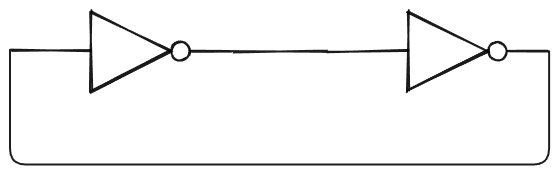

这就是1BIT的存储。但是，**这样虽然可以保持，但无法更改所存储的值**，怎么办呢？:confused:

我们知道，非门可以由与非门两个输入相接来实现，所以我们对上述电路做下图所示的变换：

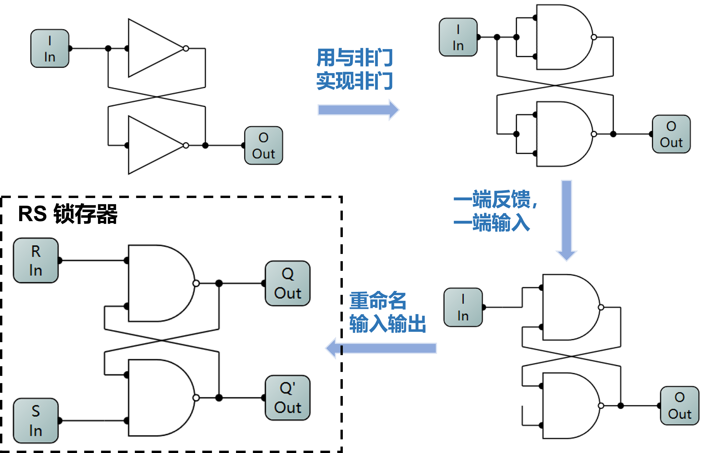

如此，就可以得到我们接触到第一个可设置存储值的存储器，这种电路称为**锁存器**，因为可以锁住电路状态。

#### 1.锁存器
通过将循环连接的非门进行上述变换而成的锁存器称为**RS锁存器**(RS Latch). S代表Set，意思是置1，R代表Reset，意思是置0. 它具有如下的特点：
（1）R'S'都为1时，可以保持1bit信息
（2）R'S'不能同时为0，没有意义，这时Q和Q'同时为1 (不是说这在物理电路上不合法，而是Q和Q'不再满足互反性，也就不再具备保持电路状态的存储功能)

为了满足R'S'不能同时为0，我们把RS合并成一个输入D，然后另一端对D取反，这就是**D锁存器**：

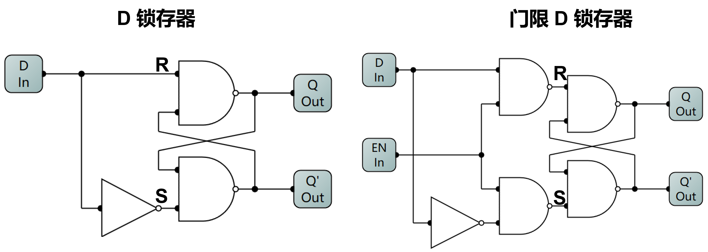

但这样（如上左图）会不能形成R=S=1的状态，而该状态才能让电路锁住其本身状态，形成存储的功能。所以，我们需要加入一个门限/使能位`EN`形成门限D锁存器（如上右图）：
+ EN = 1 $\to$ R/S由D决定,输出随D改变
+ EN = 0 $\to$ R=S=1,输出保持原有状态

但是这个电路仍然有问题，也就是它的初始状态不确定。于是，我们利用三输入与非门加入reset/set 控制位：

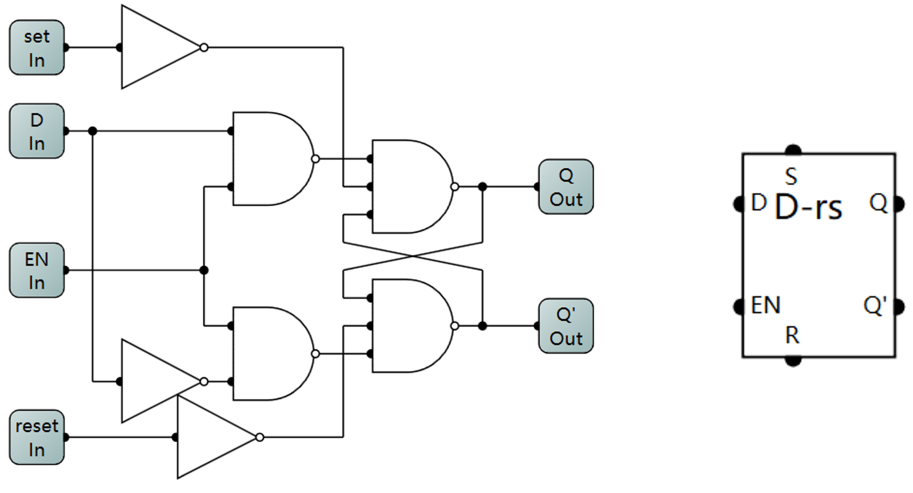

其硬件抽象如上右图所示。如此，上电之后，无论电路原先是何种状态，只需是S/R=1，便可以使Q为1/0，这样我们就得到了一个初始状态可控，可读可写可保持的D锁存器! :clap:

#### 2.时钟与触发器
但是，在计算机中，需要协调各个部件的更新时间以实现对电路状态的 **同步(synchronization)** 更新。这个协调部件的信号叫做**时钟(clock)**，它是一个周期性方波信号，这个方波信号的频率就是我们平时所说的CPU的主频，单位是赫兹Hz。因此，为了计算机电路中繁多的D锁存器都能在同一个时钟的协调下同步更新（比如都在时钟信号由0变为1的时候触发数据写入），我们需要一个用时钟来触发的D锁存器，起名为**D触发器（D-FlipFlop）**，或者叫边沿触发的D锁存器。D触发器可以用两个D锁存器串联构成：

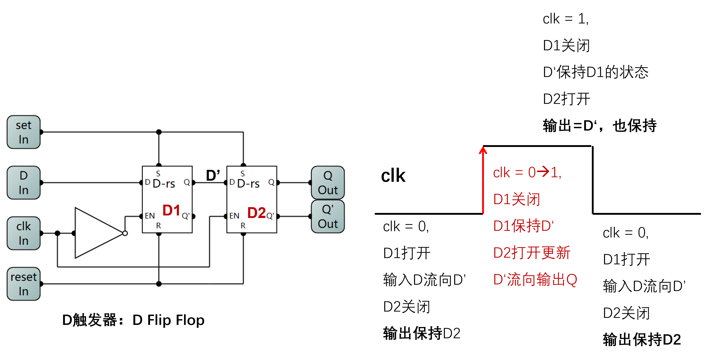

其核心思想是：在时钟的前一半周期内，D1打开D2关闭，将数据D送到D2的输入端，但此时D2关闭状态，数据还不能写入D2；在时钟从0变到1时，D1关闭D2打开，数据写入D2。

D触发器的本质是一个在时钟上升沿写入数据的1Bit存储单元。我们可以基于D触发器，设计1个字节（8bit）的存储单元：

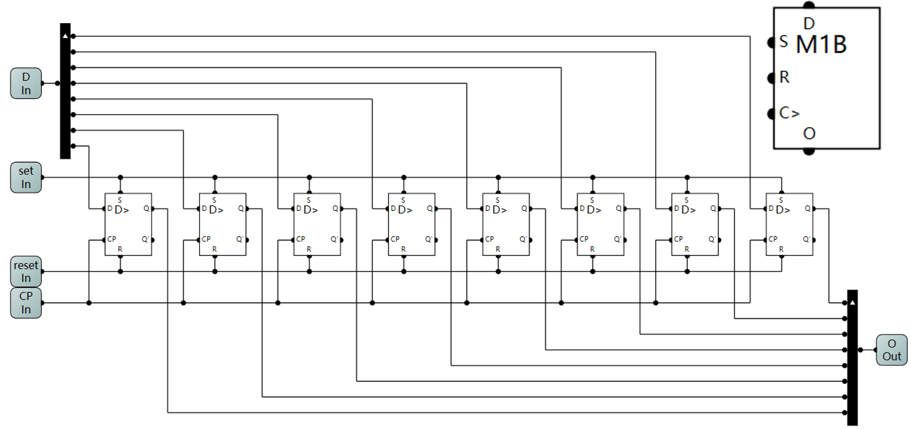

其本质和我们在第一章扩展加法器等元件时一样的，就是对输入进行按位拆分，再把各D触发器输出按位组合成一个8位的输出。

#### 3.寄存器
但是，上述D触发器电路会在每一个时钟上升沿把数据`D`写入，在实际运用中，我们往往希望能够控制它要不要写入，即区分目前我希望这个存储单元处于“**写状态**”还是“**读状态**”。为此，我们可以新增一个写使能`WriteEnable`控制位，当`WriteEnable = 1`时为写状态，在时钟上升沿时数据`D`会写入，反之当`WriteEnable = 0`时为读状态，此时及时时钟上升沿到来，也不会写入数据。

其实这个器件就是**寄存器(register)**。


基于现有的M1B(1ByteMe)可以将`WriteEnable`与时钟输入`C>`求与后连入M1B的时钟输入：


这样只有在`WriteEnable (WE) = 1`时，M1B才能接收到时钟信号的上升沿，从而触发数据写入。

#### 4.存储器扩展
基于上述寄存器(1Byte)，我们可以使用8个寄存器扩展形成一个8字节的存储单元(寄存器组)。其硬件抽象和一个1byte的寄存器应当没有太大区别，即仍然是一个8位的数据输入和一个8位的数据输出。这样做我们需要考虑2个重要的问题：1）写数据时，需要用某种方式选定要写的是8个寄存器中的哪一个，然后把数据输入写入该寄存器；2）读数据时，也需要指定要读哪个数据，然后把该寄存器的值输出。

对于第一个问题，我们在输入端新增地址(address)输入，由于我们有8个寄存器，所以地址输入的位数为： $log_28=3$ , 我们可以用`0b000`表示第一个寄存器，`0b111`表示第8个寄存器。还记得我们之前学过38译码器，如果我们将地址输入连入38译码器，那么译码器的输出信号就可以用来选定当前选中的是哪个寄存器。为了实现这个功能，我们还需要给寄存器新增一个**片选(CS-Chip Select)**信号，该信号在寄存器电路内部与写使能`WE`和时钟信号`CP`求与，也即：只有当`CS=1`,`WE=1`时才会在`CP`的上升沿更新寄存器的存储值。完整设计如下：

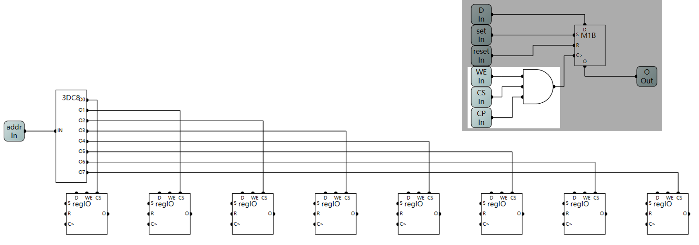

对于第二个问题，一种解决方法是：我们可以借鉴在ALU设计时所使用的方式，将8个寄存器的输出端接到一个有8个输入的数据选择器(8MUX8)上，然后将地址输入接入8MUX8的选择位上。另一种解决是考虑到我们已经用“38译码器 + CS信号”的组合解决了寄存器写选择的问题，我们可以继续利用这个CS信号，对我们的寄存器作进一步的改造，即只有当`CS=1`且`WE=0`(表示读)时才把寄存器中的存储值输出。这一改动，有助于我们用**总线**方式实现对于8个寄存器输出的选定问题。

##### 总线
所谓总线(Bus)，其本质是一种数据传输方式，即有一条公共的数据传输线，每个设备都通过一个开关连在这个总线上，但是任意时刻只有一个开关是闭合的。因此，总线结构所体现的工程思想是：**“分时复用”，即用时间换空间**。通过“每个设备轮流使用一个数据线”替代了“每个设备都有一条数据线”的方式，降低了制造数据线的成本，但代价是通信效率有所降低。

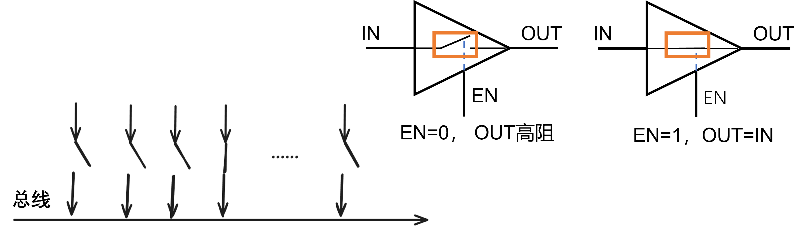

具体地，能够控制设备连入总线的开关是用一种叫做**三态门(tri-state logic)**的器件实现的。其功能为：当`EN=1`时，输入与输出连通，输出的状态等于输入，而当`EN=0`时输出与输入断开连接，输出是一个高阻态（如上图所示）。

有了总线结构的思想，我们就可以在寄存器内部，将`CS`片选信号与`~WE`写使能取反后进行与运算作为三态门的`EN`信号,来决定将不将输出连接到输出端口：

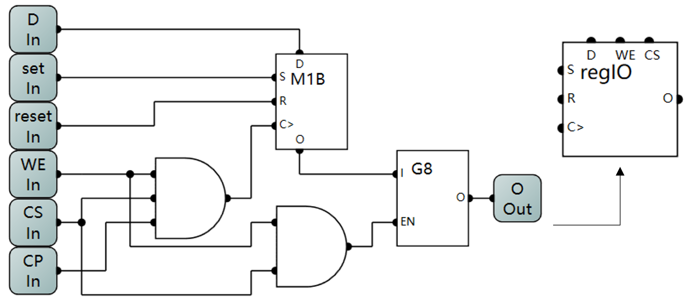

对于改造后的寄存器，其功能为：
+ `CS=1,WE=1`时在`CP(C>)`的上升沿将输入`D`写入M1B中。
+ `CS=1,WE=0`时将M1B中数据连接到输出`O`。
+ `CS=0`,寄存器保持自己的状态，接其输出端时断开状态。

有了这样的寄存器，我们就可以将其放心地连接到8Byte存储单元的输出总线上了，之所以放心，是因为各个寄存器的`CS`端是由地址线经38译码器得到，也就是任意时刻，只可能有一个寄存器被选中（其CS为输入为1）：

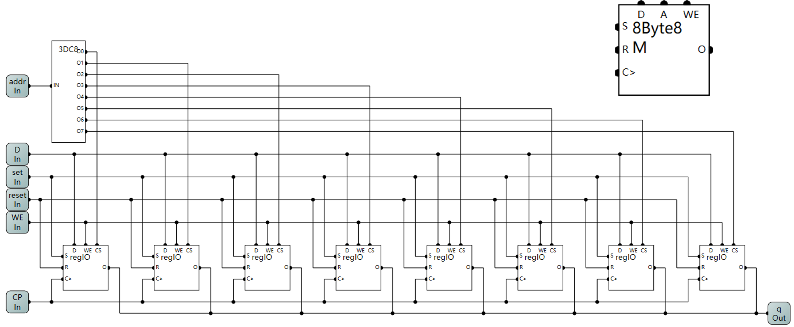

##### * 位扩展与字扩展
（选读）
有了8Byte X 8bit的存储单元，我们可以对其进行进一步的扩展，比如扩展成16Byte X 8bit，这就是字扩展，我们还可以扩展成 8Byte X 16bit，这就是位扩展。其具体实现如下：

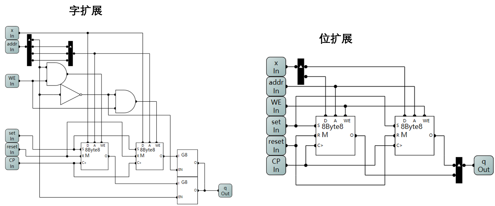

+ 字扩展
  核心思想是使用多出来的一位地址为用来选择使用哪个8Byte的存储单元。一般我们使用地址的最低位，因为切换开销小于寻址开销。

+ 位扩展
  核心思想是对输入和输出进行拆分和重组。因为之前的数据输入和输出是8位的，现在进行位扩展之后是16位的。

#### 计算机存储体系
计算机系统中有不同的存储部件，由于其物理实现手段的不同，有的存取速度快但容量较小，有的存取速度慢但是容量很大。

##### 体系结构
我们上述所讲的存储单元是计算机存储器体系中最靠近CPU的，也就是速度最快，容量最小的部件。因为它的底层是用门电路来实现的边沿D触发器，所以其读写速度由与CPU共享的时钟频率决定，可以做到和CPU一样快。而门控D锁存器需要“手动”给EN信号，所以较慢，这也就是计算机存储体系中第二快的部件，叫做SRAM（参见RAM小节），一般作为CPU和内存间的**缓存Cache**使用。下面给出计算机存储体系的结构示意图：

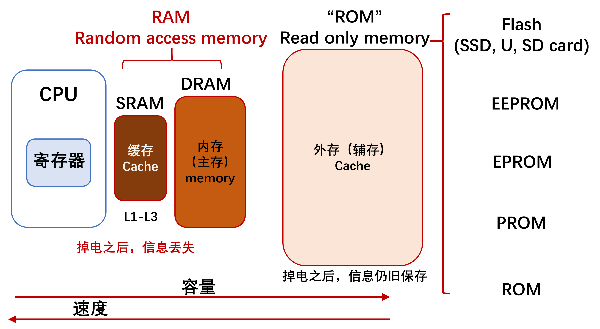

由图可知，越靠近CPU的存储部件其存取速度越快，但是容量越小。请注意，之所以会形成这样的体系结构，本质原因是：“**CPU运算速度快与存储器读写慢之间的矛盾**”。多级缓冲结构要求将高频访问的数据放入离CPU更近的存储单元中去，这能够极大地改善这种矛盾！关于这一点，在操作系统等后续课程的深入学习中会体会地更加深刻。

##### 只读存储器 Read Only Memory
此名称的由来，是由于早期计算机最基本的指令程序如BIOS(Basic Input Output System)是写入ROM中的，写入后无法修改。如今ROM的不断发展，已经可以反复读写数据了，但这个名字还是保留了下来。下面按时间顺序介绍ROM存储器的发展。
1. 可编程只读存储器 PROM (Programmable Read only memory)：采用熔丝存储数据，熔断=0，不熔断=1。
2. 可擦除可编程只读存储器 EPROM (Erasable Programmable Read only memory):高压写入数据，紫外光照射擦除。
3. 电可擦除可编程只读存储器 EEPROM (Electrically Erasable Programmable Read only memory):高压写入与擦除 (内部有电荷泵)。微控制器常用（米家热水壶）。
4. Flash：1980 日本东芝TOSHIBA 舛冈富士雄发明，主要采用MOSFET加入浮栅层，利用电子隧穿原理实现。目前主流的辅存设备如SSD, SD卡和U盘都采用这种技术。

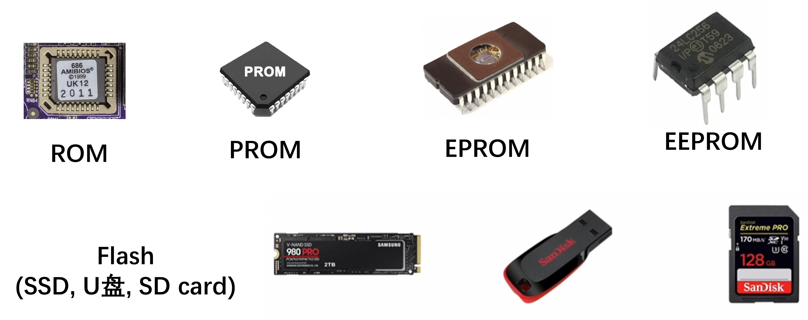

##### 随机存取存储器 Randomly Access Memory
随机存储存储器RAM主要分为静态SRAM(static)和动态DRAM(Dynamic)， SRAM就是我们之前所说的门控D锁存器，实际当中一般由4-8个门电路构成，是计算机缓冲的主要物理实现。而动态DRAM构造更加简单，有一个MOS管和一个电容组成，通过MOS管控制给电容的充放电，而控制存储的信息。电容在满电附件为逻辑1，无电为逻辑0。因为电容本身会漏电，因此DRAM需要定时刷新以保持存储的信息，因此读写速度相对于SRAM要慢很多，但由于结构更简单，可以将容量做得更大。DRAM是计算机内存的主要物理实现方式！

#### 程序计数器 Program Counter
