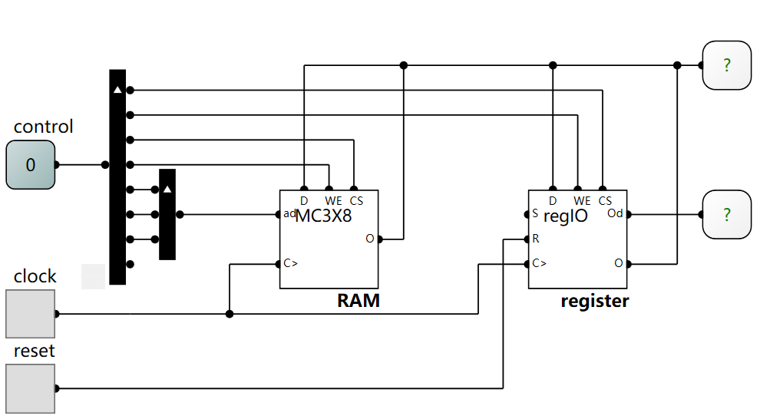

## Markdown 学习
*2025-2026-2 Principal of Computer Organization
Xuelong SUN @ GZHU*

### 标题
用`#表示标题`，几个`#`号就是几级标题

### 段落与分割线
用**空白行**将文本分段：

这是一段

这是另一端
这还是这一段

但是不同的解释器，行为可能会有所不同

`---` 或者`***`或者`___`就是分割线

---

***

___


### 强调：粗体和斜体

粗体用两个`**粗体**`包裹：**粗体**， 斜体用一个`*斜体*`:*斜体*
又粗又斜就3个`***又粗又斜***`：***又粗又斜***

### 列表

有序列表：
1. 1
2. 2
3. 3
4. 4

无序列表
+ 1
+ 2
+ 3
+ 4
或者
* 1
* 2
* 3
* 4

列表可以嵌套：
* 1
  * 1.
  * 2.

### 引用格式
> 这是一句名言
>> 引用可以嵌套
可以换行
>>> 继续嵌套
换行

### 链接与图片
1. 文内链接
   `[参见](#代码)`: [参见](#代码)
2. 超链接
   本地文档：`[参见实验1](readme.md)`: [参见实验1](readme.md)
   网页：`[参见网站](https://www.logiccircuit.org/)`: [参见网站](https://www.logiccircuit.org/)
3. 插入图片
   加个感叹号就可以 ``：

### 代码
1. 行间代码，也可做强调标识使用 ``使用这个符号`code`进行包裹``
2. 代码块
   1. python:
   ```python
   import numpy as np
   a = np.array([0, 1])
   ```
   2. C
   ```C
   #include<stdio.h>
   ```

### 数学公式

行内公式：使用美元符号进行包裹 `$公式$`：$x^2_1 = \theta_m$

行间公式：使用2个美元符号进行包裹 `$$公式$$` 或使用`代码块 math`:

$$
a^2 + b^2 = c^2
$$

```math
a^2 + b^2 = c^2
```

### 表格
```md

| Header 1 | Header 2 |
| -------- | -------- |
| Row 1    | Data 1   |
| Row 2    | Data 2   |
```
就会生成表格：

| Header 1 | Header 2 |
| -------- | -------- |
| Row 1    | Data 1   |
| Row 2    | Data 2   |

还可以指定对齐方式，注意冒号`:`的位置：
```md
| Left | Center | Right |
| :--- | :----: | ----: |
| TestText | TestText   | TestText  |
```

| Left | Center | Right |
| :--- | :----: | ----: |
| Text | Text   | Text  |
| TestText | TestText   | TestText  |

### *内联HTML
This **word** is bold. This <em>word</em> is italic.
<br>
<p style="color:red">red</p>

