# 计算机组成原理 作业

**姓名：** 何劲
**班级：** 信计251
**日期：** 2026-04-02  

---

## 第1题 进制转换

### a) 0b10110110 转十六进制和十进制

### b) -37 转二进制补码
### a) 0b10110110 转十六进制和十进制

**分组转十六进制：**

$$\underbrace{1011}_{B}\underbrace{0110}_{6} = \text{0xB6}$$

**转十进制：**

$$1\times2^7 + 0\times2^6 + 1\times2^5 + 1\times2^4 + 0\times2^3 + 1\times2^2 + 1\times2^1 + 0\times2^0$$

$$= 128 + 32 + 16 + 4 + 2 = \boxed{182}$$

---

### b) -37 转二进制补码

**第一步：** 37 的原码

$$37 = \text{0b00100101}$$

**第二步：** 取反（反码）

$$\text{00100101} \rightarrow \text{11011010}$$

**第三步：** 加一得补码

$$\text{11011010} + 1 = \boxed{\text{11011011}}$$

---

## 第2题 补码运算

已知 A = 0b00110101，B = 0b01001100，均为8bit有符号整数

### a) 只用加法计算 $A - B$

### b) 计算 $A + B$，判断是否溢出并说明理由

已知 $A = \text{0b00110101}$ 和 $B = \text{0b01001100}$，均为8bit有符号整数

$$A = \text{00110101} = +53, \quad B = \text{01001100} = +76$$

### a) 只用加法计算 $A - B$

**第一步：** 求 $-B$ 的补码

$$B = \text{01001100} \rightarrow \text{取反} \rightarrow \text{10110011} \rightarrow \text{加一} \rightarrow \boxed{\text{10110100}}$$

**第二步：** $A + (-B)$

$$\text{00110101} + \text{10110100} = \text{11101001}$$

**第三步：** 结果最高位为1，是负数，换回真值

$$\text{11101001} \rightarrow \text{取反} \rightarrow \text{00010110} \rightarrow \text{加一} \rightarrow \text{00010111} = 23$$

$$\therefore A - B = \boxed{-23}$$

---

### b) 计算 $A + B$，判断是否溢出

$$\text{00110101} + \text{01001100} = \text{10000001}$$

**判断：** 两个正数（最高位均为0）相加，结果最高位为1，表示负数，产生矛盾

$$\therefore \text{发生溢出，结果不正确}$$

> **溢出原因：** $53 + 76 = 129 > 127$，超出8bit有符号整数范围 $[-128, 127]$
<<<<<<< HEAD
## 💡 延伸思考：同余与补码的本质

> **核心思想：** 补码减法本质上是模 $2^n$ 意义下的同余运算。

对任意4位二进制数 $b$，将其按位取反记为 $\overline{b}$，则：

$$b + \overline{b} = 1111 = 2^4 - 1 = 15$$

因此：

$$2^4 - b = (b + \overline{b}) - b + 1 = \overline{b} + 1$$

> **这就是补码取反加一的数学来源！**
> $n$ 位二进制无法直接表示 $2^n$，但 $\overline{b} + 1$
> 在模 $2^n$ 意义下与 $2^n - b$ 完全等价。

---

### 🔑 二进制的优越性：为什么取反加一就是补码？

对任意4位二进制数 $b$，有：

$$b + \overline{b} = 1111_2 = 15$$

因此：

$$16 - b = 15 - b + 1 = \overline{b} + 1$$

> **这就是补码取反加一的数学来源！**
> 4位无法直接表示16，但 $\overline{b} + 1$ 在模16意义下与 $16 - b$ 完全等价。

---

### 🔑 两种情况分析（a、b 均为正数）

**情况一：** $a > b$


$$a - b > 0 \Rightarrow a + (16-b) > 16$$

结果超过16，产生第5位进位，丢掉后剩下 $a - b$。

由于 $0 < a - b < 8$，结果**一定是 `0...` 开头**，天然是正数。✅

---

**情况二：** $a < b$

$$a - b < 0 \Rightarrow a + (16-b) \in [9, 15]$$

| $a - b$ | $a - b + 16$ | 二进制 | 最高位 |
|---------|-------------|--------|--------|
| $-1$ | $15$ | `1111` | **1** |
| $-2$ | $14$ | `1110` | **1** |
| $-7$ | $9$  | `1001` | **1** |

> **结论：** $0 < a < b \leq 7$ 时，$a - b + 16$ 的范围是 $[9,15]$，**结果一定是 `1...` 开头**，天然被解读成负数，且一定正确。✅

---

### ⚠️ 溢出的本质

同余运算本身永远正确，溢出是**解读问题**：

| 运算类型 | 溢出可能性 | 原因 |
|---------|-----------|------|
| 正 $+$ 负 | ✅ 不溢出 | 结果一定在范围内 |
| 负 $+$ 正 | ✅ 不溢出 | 同上 |
| 正 $+$ 正 | ⚠️ 可能溢出 | 结果可能超过 $+7$ |
| 负 $+$ 负 | ⚠️ 可能溢出 | 结果可能小于 $-8$ |

> **判断方法：** 两个正数相加得到负数，或两个负数相加得到正数，即为溢出。
# 第3题：4-bit ALU 设计

## a) 所需数据选择器及其作用

### 选择器类型

本设计需要一个 **4选1 多路数据选择器（4-to-1 MUX）**，其每一位均为4输入1输出结构，对应4位数据通路则需要4个并联的4选1 MUX（或等价的 4位宽 4选1 MUX）。

### 作用

ALU 需要支持4种操作：

| 操作 | 说明 |
|------|------|
| `X1 + X2` | 加法 |
| `X1 - X2` | 减法（补码加法） |
| `X1 AND X2` | 按位与 |
| `X1 XOR X2` | 按位异或 |

加法器只能输出一种结果，因此需要用 MUX 在4种候选结果中根据操作码 `OP[1:0]` 选择正确的输出送至 `Y`。

**MUX 的核心作用：** 以操作码作为选择信号，从多个并行计算结果（加、减、与、异或）中选出当前指令对应的输出，实现"功能复用"。

---

## b) 操作码设计与电路实现

### 操作码分配

使用 2-bit 操作码 `OP[1:0]`，共4种编码：

| `OP[1]` | `OP[0]` | 操作 | 说明 |
|---------|---------|------|------|
| `0` | `0` | `X1 + X2` | 加法 |
| `0` | `1` | `X1 - X2` | 减法 |
| `1` | `0` | `X1 AND X2` | 按位与 |
| `1` | `1` | `X1 XOR X2` | 按位异或 |

### 关键设计：复用同一个4位加法器实现加/减

减法 `X1 - X2` 可用补码加法实现：

$$X1 - X2 = X1 + (\overline{X2} + 1) = X1 + \overline{X2} + C_{in}$$

令 `SUB = OP[0]`（减法时为1）：

- 对 `X2` 的每一位取异或：`B_i = X2_i XOR SUB`
  - `SUB=0`（加法）：`B_i = X2_i`（直通）
  - `SUB=1`（减法）：`B_i = NOT X2_i`（取反）
- 将 `SUB` 同时连接至加法器进位输入 `Cin`，实现 `+1`

这样，**同一个加法器** 既完成加法又完成减法。

### 电路结构

```
        X1[3:0]          X2[3:0]
           │                │
           │        ┌───────┤
           │        │  XOR  │ ◄── SUB (= OP[0])
           │        │ gates │     （每位异或SUB）
           │        └───┬───┘
           │            │ B[3:0]
           ▼            ▼
      ┌─────────────────────┐
      │   4-bit 加法器       │ ◄── Cin = SUB (= OP[0])
      │   (ripple carry /   │
      │    full adder ×4)   │
      └──────────┬──────────┘
                 │ SUM[3:0]
                 ▼
         ┌───────────────┐
         │               │
X1 AND X2 ──► I2          │
X1 XOR X2 ──► I3          │  4选1 MUX (4位宽)
       SUM ──► I0          │ ◄── 选择信号: OP[1:0]
SUM(减法结果─► I1          │    (加减法时SUM/I0/I1,
         │               │     由OP[0]区分)
         └───────┬───────┘
                 │
                Y[3:0]
```

> **注：** I0接加法结果（OP=00），I1接减法结果（OP=01）—— 由于加减法均由同一加法器计算，只需在MUX I0/I1端口均连接加法器输出 `SUM`，MUX 凭借 OP 编码自动选择正确结果（此时I0=I1=SUM，无需额外区分）。

---

## 电路原理图

```
                         OP[1]  OP[0]
                           │      │
                           │      └────────────────────┐
                           │                           │ SUB
  X1[3:0] ─────────────────┼──────────────────────────┼──────────────►┐
                           │                           │               │
  X2[3:0] ─────────────────┼──────────┬────────────── │ ─────────────►│
                           │          │               │               │
                           │          │  ┌─────────┐  │               │
                           │          └─►│  XOR ×4 │◄─┘               │
                           │             └────┬────┘                  │
                           │                  │ B[3:0]                │
                           │             ┌────▼──────────────┐        │
                           │             │                   │        │
                           └────────────►│  4-bit Adder      │◄── Cin=SUB
                                         │  (X1 + B + Cin)   │
                                         └────────┬──────────┘
                                                  │ SUM[3:0]
                           ┌──────────────────────┘
                           │
           X1 AND X2 ──────┼──► MUX_I2
           X1 XOR X2 ──────┼──► MUX_I3      ┌───────────────────┐
                SUM ───────┼──► MUX_I0      │   4-to-1 MUX      │
                SUM ───────┴──► MUX_I1      │  (4位宽)           │──► Y[3:0]
                                            │                   │
                           OP[1] ──────────►│ S1                │
                           OP[0] ──────────►│ S0                │
                                            └───────────────────┘

选择逻辑：
  OP = 00  →  选 MUX_I0 (SUM) → X1 + X2
  OP = 01  →  选 MUX_I1 (SUM, Cin=1, B=~X2) → X1 - X2
  OP = 10  →  选 MUX_I2 (AND结果)
  OP = 11  →  选 MUX_I3 (XOR结果)
```

### 逻辑门明细

| 模块 | 组成 | 数量 |
|------|------|------|
| X2 取反控制 | 2输入 XOR 门 | 4个（每位一个） |
| AND 运算 | 2输入 AND 门 | 4个（每位一个） |
| XOR 运算 | 2输入 XOR 门 | 4个（每位一个） |
| 4位加法器 | 全加器 FA ×4 | 1个（共4位） |
| 4选1 MUX | 4位宽4选1 | 1个 |

### 各模块信号定义汇总

| 信号 | 位宽 | 描述 |
|------|------|------|
| `X1[3:0]` | 4 | 操作数1（输入） |
| `X2[3:0]` | 4 | 操作数2（输入） |
| `OP[1:0]` | 2 | 操作码（输入） |
| `SUB` | 1 | 减法控制 = `OP[0]` |
| `B[3:0]` | 4 | 经异或处理的X2（加法器B端口） |
| `SUM[3:0]` | 4 | 加法器输出（加法或减法结果） |
| `Y[3:0]` | 4 | ALU 输出（最终结果） |

---

## 设计总结

本设计的核心思路是：
1. 利用 **XOR门 + 进位输入** 复用同一加法器同时实现加减法，节省硬件资源；
2. 用 **2-bit 操作码** 控制 **4选1 MUX** 在4种运算结果（加、减、与、异或）中选择输出；
3. AND 和 XOR 运算直接由逻辑门并行计算，无需额外时序。

整个电路仅需：**1个4位加法器 + 1个4选1 MUX + 若干逻辑门**，结构简洁高效。
### 
