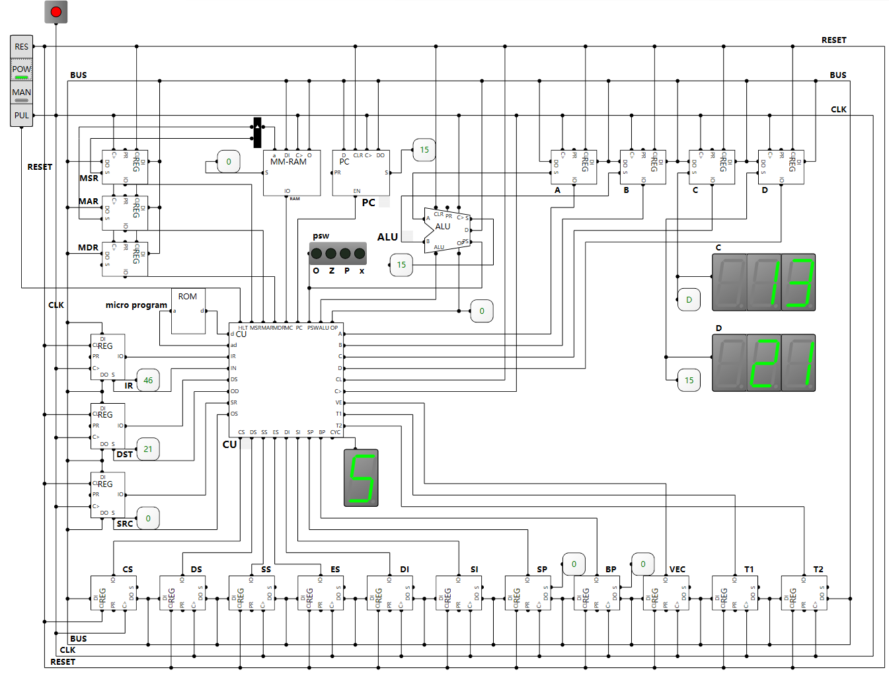

### Principles of Computer Organization
2025-2026-2 @ GZHU, CHN

**Goal of this course is to made a 8-Bit programmable CPU from NAND.**

##### Courses
+ Chapter 1 - ALU
  + Number System
  + Semi-conduct
  + Logical Gates and Boolean Operation
  + Half-adder, full adder
  + 2'complement and Subtraction
  + Multiplexor
  + 3-8 Decoder
  + Arithmetic Logical Unit (ALU) Design
+ Chapter 2 - Memory
  + 1bit memory
  + latches: SR, D
  + Flip Flop
  + Register
  + RAM/ROM
  + Program Counter

##### Labs

